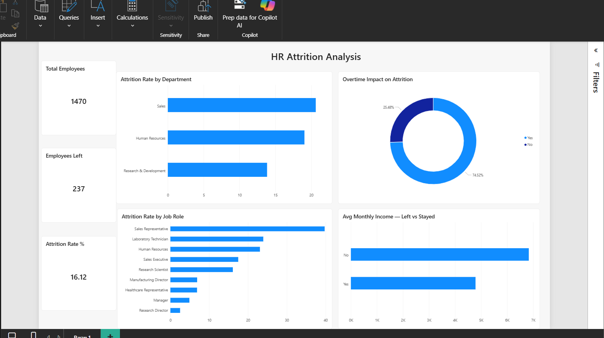

# HR Employee Attrition Analysis Dashboard

## Project Overview
This project analyzes IBM's HR Employee Attrition dataset to identify 
why employees are leaving the company and provide data-driven 
recommendations to HR leadership on reducing attrition.

Built using SQL for data analysis and Power BI for visualization.

---

## Dashboard Preview

---

## Business Problem
A company is experiencing higher than industry-average employee attrition. 
HR leadership needs to understand:
- How severe is the attrition problem?
- Which departments and roles are most affected?
- What are the root causes driving employees to leave?
- What actions should HR take to improve retention?

---

## Business Questions Answered
1. What is the overall employee attrition rate?
2. Which department has the highest attrition?
3. Does working overtime affect attrition rate?
4. Which job roles are losing the most employees?
5. Does monthly income affect an employee's decision to leave?

---

## Key Insights

### 🔴 Overall Attrition
- **16.12% attrition rate** — above the healthy industry benchmark 
  of 10–12%
- 237 out of 1,470 employees left the company

### 🔴 Department Analysis
- **Sales** has the highest attrition at ~20% — significantly above 
  company average
- **Research & Development** has the lowest attrition — suggesting 
  better working conditions or career growth

### 🔴 Overtime Impact — Strongest Finding
- Employees working overtime have **30.53% attrition rate**
- Employees NOT working overtime have only **10.44% attrition rate**
- Overtime employees are **nearly 3x more likely to leave** — 
  the single strongest predictor of attrition in this dataset

### 🔴 Job Role Analysis
- **Sales Representatives** have the highest attrition at ~40% — 
  the most at-risk role in the company
- **Research Directors** have near 0% attrition — highest retention
- Frontline sales roles are clearly the biggest retention challenge

### 🔴 Salary Impact
- Employees who **left** earned average **$4,787/month**
- Employees who **stayed** earned average **$6,832/month**
- Leavers earned **30% less** than stayers — salary is a 
  significant attrition driver

---

## Connected Insight — The Full Picture
*"The attrition problem is concentrated in Sales — specifically 
Sales Representatives who are overworked (overtime), underpaid 
(30% below average), and leaving at 40% rate. HR should prioritize 
Sales Representative compensation review and overtime policy reform 
as the highest-impact retention interventions."*

---

## Recommendations
1. **Cap overtime immediately** — especially in Sales. 
   Overtime employees are 3x more likely to leave.
2. **Benchmark Sales Representative compensation** — 
   leavers earn 30% less than stayers. Salary adjustment 
   is critical for frontline sales retention.
3. **Conduct stay interviews** with current Sales employees 
   to identify additional pain points beyond salary and overtime.
4. **Study R&D retention practices** — Research & Development 
   has the lowest attrition. Apply those practices to Sales.
5. **Flag all overtime employees as high flight-risk** — 
   HR should proactively engage these
